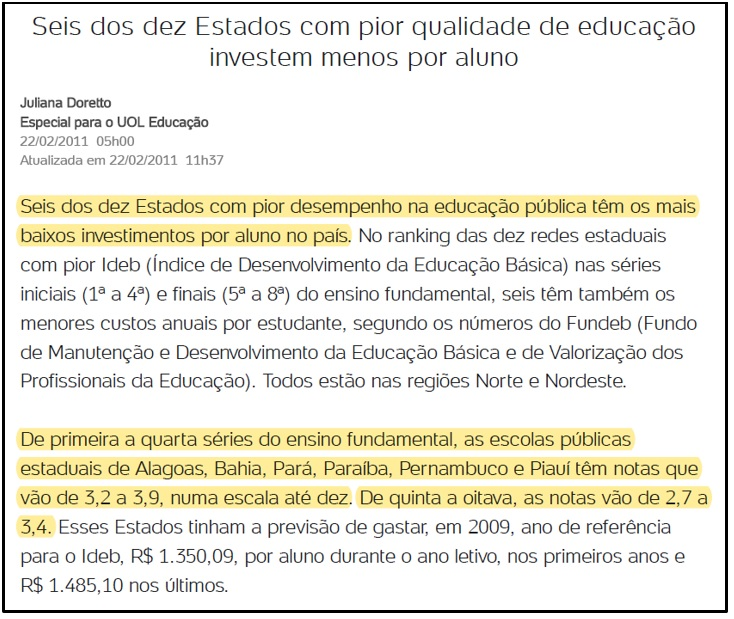

# Piauí: um Estado esforçado, porém (ainda) pouco recompensado

Certa vez li uma matéria sobre investimento por aluno na educação pública . Era uma reportagem que mostrava uma aparente correlação entre o orçamento para a educação pública e o desempenho estudantil, segundo o Ideb (Índice de Desenvolvimento da Educação Básica) em diferentes estados brasileiros; porém, focando nos dez estados com os piores índices. Tal leitura foi há alguns anos. 

Eis os dois primeiros parágrafos daquela reportagem de 2011:

[Fonte: UOL Educação.](https://educacao.uol.com.br/noticias/2011/02/22/seis-dos-dez-estados-com-pior-qualidade-de-educacao-investem-menos-por-aluno.htm)  

Desde a reportagem até o ENEM 2019 passaram-se quase 10 anos.
 
Vamos verificar se o desempenho dos candidatos do Enem 2019 nos seis estados citados na notícia sugere algum avanço após esse período. A figura a seguir apresenta um diagrama de caixa, comparando o desempenho destes seis estados com o restante dos estados brasileiros, mas apenas dos candidatos que cursam ou cursaram o ensino médio em escola pública.
